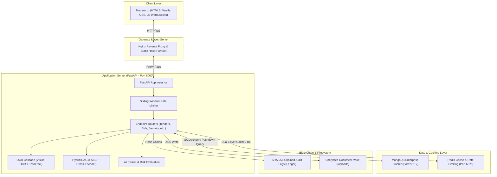

# Architectural Blueprint & System Design: GEM Tender Procurement Ecosystem

This document serves as the official system architecture and technical blueprint for the **GEM Tender Procurement Ecosystem**. It outlines the core tech stack, microservices, database schemas, AI modules, cryptographic trust layers, and recent performance optimizations.

---

## 1. Executive Summary
The GEM Tender Procurement Ecosystem is an enterprise-grade, secure, and AI-driven procurement platform designed to handle the end-to-end lifecycle of government contracts. By integrating advanced optical character recognition (OCR), retrieval-augmented generation (RAG), block-based image forensics, and a cryptographically chained audit trail, the system ensures efficiency, complete transparency, and protection against vendor collusion.

---

## 2. Core System Architecture

The ecosystem is built upon a decoupled, service-oriented architecture comprised of a static Nginx web layer, a FastAPI application server, MongoDB, and Redis caching.



### Component Details
1. **Frontend Layer**: Vanilla HTML5, CSS3 (utilizing HSL color spaces, glassmorphism, and responsive CSS variables), and vanilla Javascript. Communications to the backend utilize REST APIs for CRUD operations and WebSockets for real-time audit log streaming and live reverse auctions.
2. **Backend API (FastAPI)**: Runs asynchronously via Uvicorn. Implements a sliding-window rate limiter utilizing Redis (falling back to memory in development).
3. **Database Layer (MongoDB + Compatibility Layer)**: MongoDB holds all persistent models. A custom object-mapper in `database.py` maps SQLAlchemy-like queries to PyMongo execution vectors.
4. **Distributed Cache (Redis)**: Holds sliding-window IP limits, session telemetry, and the primary layer of the LLM caching system.

---

## 3. The 9-Stage IOCL Procurement Lifecycle

The core application implements the 9 distinct lifecycle stages specified by IOCL guidelines:

```
[Stage 1: Indent/PR] ──> [Stage 2: KYC Verification] ──> [Stage 3: Secure Bid Vault]
                                                                │
[Stage 6: PAC Award] <── [Stage 5: Reverse Auction] <── [Stage 4: Technical Eval]
        │
        └──> [Stage 7: SAP PO/GRN] ──> [Stage 8: AI Arbitration] ──> [Stage 9: Release Payment]
```

### Phase-by-Phase Technical Details

1. **Stage 1: Material Indent (Purchase Requisition)**
   - **Router**: `routers/iocl.py`
   - **DB Models**: `Indent` (SAP PR number, material code, quantity, urgency).
   - **Flow**: Generates a requisition that, once approved, automatically compiles and publishes a Notice Inviting Tender (NIT).

2. **Stage 2: Vendor Deepfake KYC Verification**
   - **Router**: `routers/vendors.py`
   - **Verification**: Streams video frames to the backend biometrics engine. Computes pixel movement consistency to verify vendor liveness; scores $< 85\%$ prompt auto-blacklisting in `Vendor` profile.

3. **Stage 3: Secure Bid Vault Submission**
   - **Router**: `routers/bids.py`
   - **DB Models**: `Bid`, `BidDocument`.
   - **Flow**: Vendors upload technical specs and financial bids. Documents are cryptographically locked in the storage vault and hashes are committed to the blockchain.

4. **Stage 4: AI Semantic Evaluation**
   - **Router**: `routers/evaluation.py`
   - **Flow**: Triggered post-deadline. The OCR Cascade extracts document text and evaluates compliance checks against `EvaluationCriteria` via the AI Compliance Engine.

5. **Stage 5: Reverse Auction & Financial Opening**
   - **Router**: `routers/bids.py` (WebSocket-driven)
   - **Flow**: Unlocks financial bids of technically qualified vendors. Initiates real-time WebSocket bidding streaming the lowest (L1) price to all clients.

6. **Stage 6: QCBS & PAC Digital Meeting**
   - **Router**: `routers/reports.py` & `routers/iocl.py`
   - **Flow**: Computes composite Quality-Cost Based Selection (QCBS) score ($Composite = 0.70 \times Tech + 0.30 \times Finance$). Minting smart contracts on approval.

7. **Stage 7: SAP PO & Goods Delivery**
   - **Router**: `routers/iocl.py`
   - **DB Models**: `PurchaseOrder`, `DeliveryRecord` (GRN, Inspection Status).
   - **Flow**: Triggers Purchase Order acceptance. Logs incoming Goods Receipt Notes (GRN).

8. **Stage 8: AI Arbitration Court**
   - **Router**: `routers/disputes.py`
   - **DB Models**: `DisputeCase`.
   - **Flow**: Evaluates delivery delays or defective products against the Liquidated Damages (LD) clause. Auto-calculates deductions and updates the vendor reliability rating.

9. **Stage 9: 3-Way Match & Payment Release**
   - **Router**: `routers/iocl.py`
   - **DB Models**: `PaymentRecord`.
   - **Flow**: Matches `PurchaseOrder.po_value === DeliveryRecord.received_quantity === Invoice.amount`. Auto-deducts arbitration penalties and release payments with UTR mapping.

---

## 4. Intelligent AI & Forensics Pipelines

The platform incorporates state-of-the-art NLP, RAG, OCR, and image forensic subsystems to protect transaction integrity.

### A. The OCR Cascade Engine
Fitted with a multi-strategy preprocessing and OCR engine cascade:
- **Preprocessing Pipeline**: Integrates Hough Line Transform deskewing, Contrast Limited Adaptive Histogram Equalization (CLAHE) contrast enhancements, bilateral denoising, and adaptive/Otsu binarizations.
- **Cascade Sequence**: Digital text layers are extracted directly via PyPDF2. Scanned documents fallback to a cascade:
  $$\text{VisionOCR-CLAHE} \longrightarrow \text{VisionOCR-Deskew} \longrightarrow \text{Tesseract-PSM3} \longrightarrow \text{Tesseract-PSM6} \longrightarrow \text{Table-CellOCR}$$
- **Table Cell Grid Matcher**: OpenCV detects bounding boxes of cells in tabular documents, running cell-level character recognition for structured values.

### B. Hybrid RAG Search & Retrieval Pipeline
Integrates semantic bi-encoders, lexical matchers, and cross-encoders:
1. **Multi-Query Formulation**: Input queries generate three distinct variants through the LLM.
2. **Dense Retrieval (FAISS)**: Searches top-$k$ candidate document chunks utilizing the HuggingFace `all-mpnet-base-v2` dense embedding model.
3. **Lexical Match (TF-IDF)**: Calculates term overlap scores for all candidate chunks.
4. **Bi-Encoder Re-Ranking**: Computes exact cosine similarities between the dense vector of the query and candidate documents.
5. **Cross-Encoder Re-Ranking**: Passes query-document pairs to the `ms-marco-MiniLM-L-6-v2` cross-encoder to compute a unified relevancy score.
6. **Relevance Thresholding**: Filters out any chunk with an aggregate score under `rag_min_relevance` to eliminate model hallucinations.

### C. Collusion & Cartel Detector
Analyzes bidding patterns across bids and vendors:
- **Herfindahl-Hirschman Index (HHI)**: Calculates market concentration index ($\sum S_i^2$). High index scores warn administrators of low competitive markets.
- **Benford's Law Chi-Square Verification**: Computes first-digit distribution of bid amounts and calculates a Chi-Square statistic ($\chi^2 = \sum \frac{(O_i - E_i)^2}{E_i}$). High deviations flag fabricated bidding structures.
- **Bid Clustering**: Identifies pricing proximity ($<0.5\%$ price variance) indicating collusion or pre-auction coordination.

---

## 5. Security & Cryptographic Trust Layers

Security is baked directly into the system workflow, rather than added as a peripheral layer.

### A. SHA-256 Cryptographic Audit Ledger
Every system action (bid submit, kyc, PO creation) is cryptographically linked to the previous log:
$$\text{Block Hash}_N = \text{SHA256}(\text{Block Data}_N \parallel \text{Block Hash}_{N-1})$$
A full verification scan traverses the entire database collection sequentially, checking for structural breakages (`LINK_BREAK`) or modified values (`CONTENT_TAMPERED`).

### B. Pixel-Level Image Forensics
Analyzes files uploaded to the Bid Vault for alterations:
- **Error Level Analysis (ELA)**: Resaves images at target qualities ($90, 75, 50$) and computes pixel-level differences. High-variance regions highlight edited text, fake stamps, or spliced logos.
- **Copy-Move Forgery Detection**: Splits images into non-overlapping grids, computing DCT features for block matching. Finds duplicate shapes placed at different coordinates (indicative of digital cloning/masking).
- **EXIF Metadata Forensics**: Flags software signatures (e.g. Adobe Photoshop, GIMP) and checks creation vs modification date mismatches.

---

## 6. Performance Optimization Architecture

To support high concurrency and data growth, the platform incorporates three performance layers:

1. **MongoDB Query Pushdown Translator**:
   - Instead of fetching all collection documents for processing in memory, a recursive translator compiles SQLAlchemy-like expressions into PyMongo query filters.
   - Pushes queries, sort lists, skips, and limits directly down to MongoDB's indexing engine.
   - Converts `.count()` queries to native `count_documents` execution.
2. **Event Loop Protection**:
   - Heavy, CPU-bound image forensics operations (ELA, DCT Copy-Move matching) are delegated to external worker threads using `asyncio.to_thread`.
   - Prevents blocking FastAPI's async event loop.
3. **Dual-Layer Shared Caching**:
   - LLM responses are cached using a dual-stage system: Redis is checked first for high-performance distributed caching, falling back to local file-based storage in `llm_cache/` if the Redis instance is offline.
