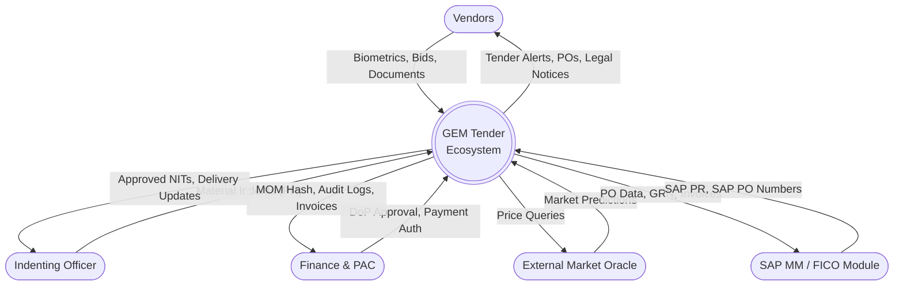
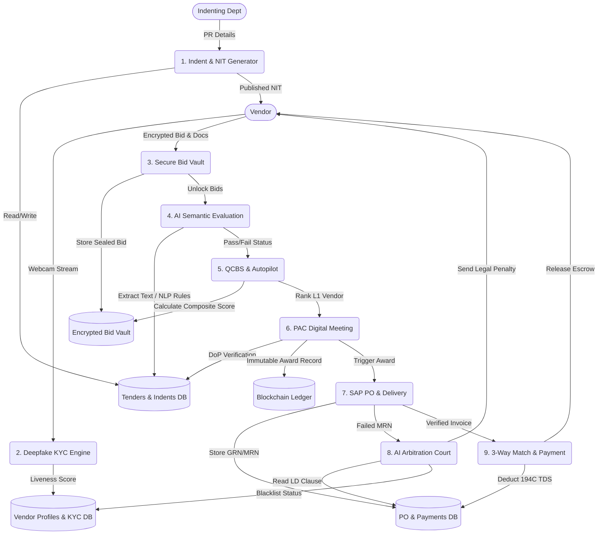

# GEM Ecosystem Data Flow Diagrams (DFD)

Here is the complete data flow mapping for the GEM Tender Procurement Ecosystem.

## Level 0 Context Diagram
This diagram shows how external entities (Vendors, Indenting Officers, Finance, and AI Oracles) interact with the core GEM System.

---

## Level 1 Data Flow Diagram
This details the internal microservices, specific data transformations, and storage systems across the 9-stage IOCL pipeline.

## Explanation of Key Flows:
1. **The Indent Flow (`P1`):** An officer submits a requirement. The system writes it to `DB_Tender` and auto-publishes an NIT.
2. **The Security Flow (`P2`, `P3`):** Vendors must pass `P2` (Deepfake Biometrics). Approved vendors push AES-encrypted data to `P3` (Bid Vault).
3. **The Brain (`P4`, `P5`):** The AI NLP Engine evaluates the technical documents. The Autopilot handles QCBS math to determine the financial winner.
4. **The Closure Flow (`P7`, `P8`, `P9`):** Goods are received in `P7`. If defective, `P8` (Arbitration) automatically penalizes the vendor in `DB_Vendor`. If successful, `P9` calculates taxes and finalizes the ledger.
